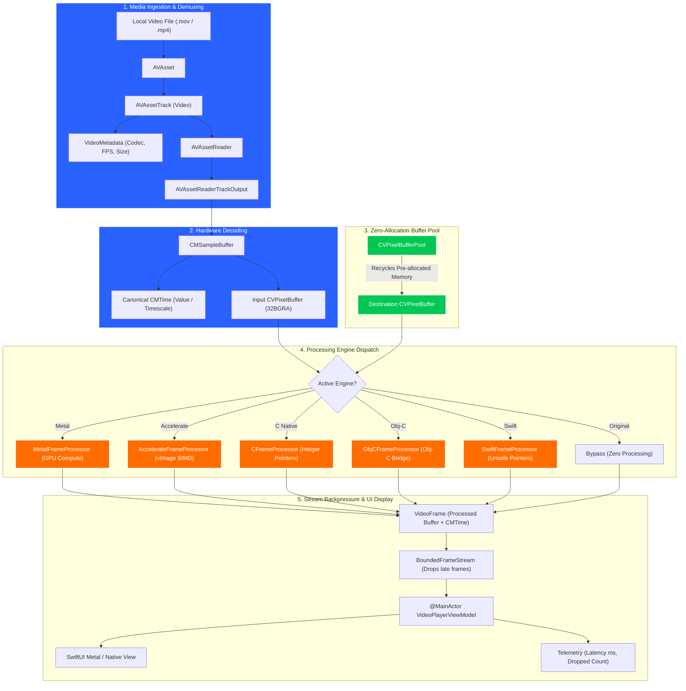
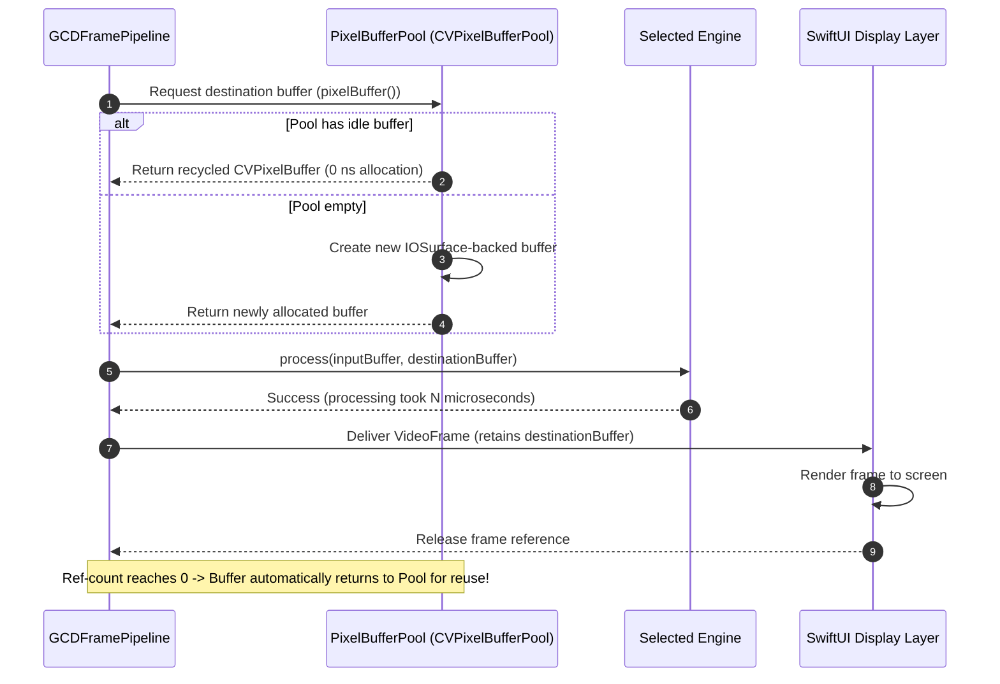
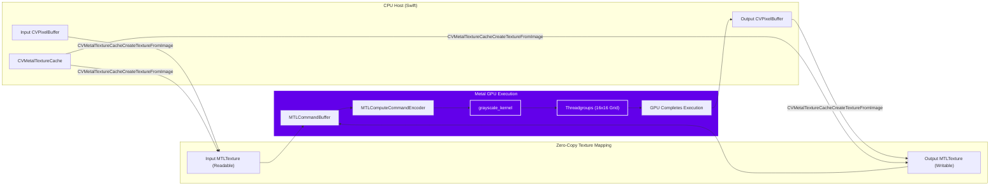
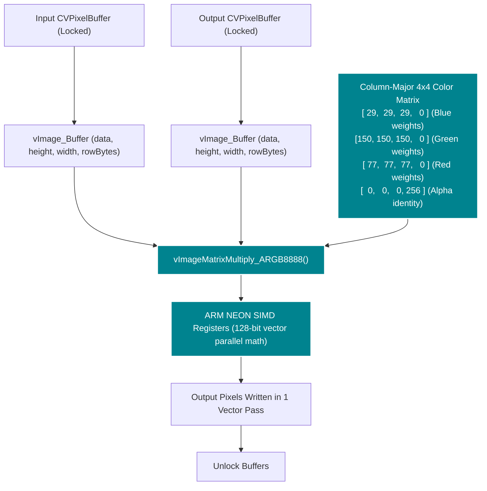

# Video Processing & App Architecture Learning Guide

Welcome to the **FrameLab Learning Guide**. This document explains in detail:
1. Every core feature of the FrameLab application.
2. The exact video processing operations applied to frames.
3. The end-to-end media pipeline with comprehensive architectural flow charts.
4. How each of the 5 processing backends (Metal, Accelerate, C, Objective-C, Swift) operates on uncompressed pixel memory.

---

## Table of Contents

- [1. App Features Breakdown](#1-app-features-breakdown)
- [2. What We Process in Video (The Color & Mathematical Foundations)](#2-what-we-process-in-video-the-color--mathematical-foundations)
- [3. Architectural Flow Charts](#3-architectural-flow-charts)
  - [3.1 End-to-End Media Pipeline](#31-end-to-end-media-pipeline)
  - [3.2 Zero-Allocation Buffer Pool Recycling](#32-zero-allocation-buffer-pool-recycling)
  - [3.3 Backpressure & Frame-Dropping Concurrency](#33-backpressure--frame-dropping-concurrency)
  - [3.4 Metal Zero-Copy GPU Dispatch Pipeline](#34-metal-zero-copy-gpu-dispatch-pipeline)
  - [3.5 Accelerate vImage Vector SIMD Pipeline](#35-accelerate-vimage-vector-simd-pipeline)
- [4. The 5 Processing Backends Deep Dive](#4-the-5-processing-backends-deep-dive)
  - [4.1 Backend Comparison Matrix](#41-backend-comparison-matrix)
  - [4.2 Metal Compute Engine](#42-metal-compute-engine)
  - [4.3 Accelerate / vImage Engine](#43-accelerate--vimage-engine)
  - [4.4 Native C Engine](#44-native-c-engine)
  - [4.5 Objective-C Engine](#45-objective-c-engine)
  - [4.6 Pure Swift Baseline](#46-pure-swift-baseline)
- [5. Step-by-Step Lifecycle of a Single Video Frame](#5-step-by-step-lifecycle-of-a-single-video-frame)
- [6. Key Video Engineering Concepts & Definitions](#6-key-video-engineering-concepts--definitions)

---

## 1. App Features Breakdown

FrameLab is designed as a clean, technically credible macOS and iOS video-engineering demonstration application. Here is what each feature does:

```
┌────────────────────────────────────────────────────────────────────────────────────────┐
│                                 FRAMELAB APPLICATION                                   │
├──────────────────────────┬─────────────────────────────┬───────────────────────────────┤
│    MEDIA INSPECTION      │      REAL-TIME FILTER       │     PERFORMANCE BENCHMARK     │
│ • Codec (H.264/HEVC/Pro) │ • 5 Swappable Engines       │ • 100-Frame Batch Execution   │
│ • Resolution & Bitrate   │ • Live Latency Display (ms) │ • Min / Max / Mean / Median   │
│ • Exact FPS & ColorSpace │ • Zero-Copy Texture Cache   │ • 95th Percentile Latency     │
│ • Rational CMTime Format │ • Dropped Frame Telemetry   │ • FPS Throughput Comparison   │
├──────────────────────────┴─────────────────────────────┴───────────────────────────────┤
│                                 INFRASTRUCTURE SERVICES                                │
│ • CVPixelBufferPool Buffer Recycling (Zero per-frame heap churn)                       │
│ • Bounded Concurrency Streams (Non-blocking UI, latest-frame drop policy)              │
│ • Precise Still-Frame Export (Lossless PNG / JPEG with ImageIO)                        │
└────────────────────────────────────────────────────────────────────────────────────────┘
```

### 1.1 Video Asset Inspection & Codec Telemetry
- **File Ingestion**: Users can select any local video container (`.mov`, `.mp4`, `.m4v`) or tap the built-in test pattern generator.
- **Track Inspection**: Uses `AVAsset` and `AVAssetTrack` asynchronously (`load(.tracks, .duration)`) to extract:
  - **Resolution**: Width $\times$ Height (e.g., $1920 \times 1080$, $1280 \times 720$).
  - **Codec FourCC**: Formatted human-readable codec names (`H.264 / AVC`, `HEVC / H.265`, `Apple ProRes 422`, etc.).
  - **Nominal Frame Rate**: Precise floating-point FPS derived from `track.nominalFrameRate`.
  - **Average Bitrate**: Formatted in `Mbps` or `kbps`.
  - **Color Space**: Color primaries and transfer characteristics (e.g., `BT.709` for HD, `BT.2020` for HDR).
  - **File Size**: Human-readable file size in `MB`.


### 1.2 5-Engine Live Processing Switcher
- The top toolbar displays an engine picker: **Original**, **Metal**, **Accelerate**, **C**, **Objective-C**, and **Swift**.
- Switching engines happens immediately during playback without pausing or recreating the decoder.
- A live telemetry HUD overlays the active engine name, current frame latency in milliseconds, and total dropped frames.

### 1.3 Zero-Allocation Buffer Pool Recycling
- Video frames at 60 FPS in $1080\text{p}$ require:
  $$1920 \times 1080 \times 4\text{ bytes} \approx 8.29\text{ MB per frame} \times 60 \approx 497\text{ MB/second}$$
- Allocating ~500 MB/sec on the system heap causes severe memory churn and thermal throttling.
- FrameLab utilizes [`PixelBufferPool`](file:///Users/alok/Documents/Dev%20Workspace/FrameLab/Packages/FrameLabCore/Sources/FrameLabCore/Memory/PixelBufferPool.swift) (`CVPixelBufferPool`) to allocate a fixed pool of IOSurface-backed buffers once, recycling them seamlessly with zero heap allocations per frame.

### 1.4 Concurrency & Non-Blocking UI
- Frame decoding and pixel processing execute on background GCD queues (`com.framelab.pipeline.processing`).
- UI rendering and telemetry display execute strictly on `@MainActor`.
- Bounded async streams (`BoundedFrameStream`) ensure slow processing engines drop frames rather than backlog the decoder or freeze the user interface.

### 1.5 Statistical Benchmarking Suite


- Opens a dedicated benchmarking sheet.
- Runs 100 consecutive frames through all 5 engines under identical conditions.
- Profiles execution times with microsecond precision and computes:
  - **Minimum, Maximum, Mean, Median** latency.
  - **p95 Latency**: Evaluates frame-pacing smoothness and stutter likelihood.
  - **Throughput FPS**: Demonstrates peak offline processing throughput ($1000 / \text{Mean ms}$).

### 1.6 Exact Frame Extraction & Export
- Users can pause playback at any precise rational `CMTime` and export the current frame.
- FrameLab packages the active processed `CVPixelBuffer` into an uncompressed `CGImage` and writes it to disk using Apple's `ImageIO` framework in lossless PNG or compressed JPEG format.

---

## 2. What We Process in Video (The Color & Mathematical Foundations)

FrameLab performs **real-time per-pixel Grayscale conversion** across uncompressed video frames.

### 2.1 The Pixel Format: `kCVPixelFormatType_32BGRA`
Digital video is commonly decoded from compressed YUV 4:2:0 formats into uncompressed 32-bit interleaved BGRA color space:
- **Bytes per pixel**: 4 bytes.
- **Memory ordering (Little-Endian)**:
  - Byte 0: **Blue** ($B$, 0–255)
  - Byte 1: **Green** ($G$, 0–255)
  - Byte 2: **Red** ($R$, 0–255)
  - Byte 3: **Alpha** ($A$, 0–255, transparency)

```
Pixel Memory Layout (32 bits / 4 bytes):
┌───────────┬───────────┬───────────┬───────────┐
│  Byte 0   │  Byte 1   │  Byte 2   │  Byte 3   │
│   Blue    │   Green   │    Red    │   Alpha   │
└───────────┴───────────┴───────────┴───────────┘
```

### 2.2 The Luma Conversion Equation (Rec. 601)
Human vision does not perceive all light wavelengths with equal brightness; the human eye is most sensitive to green, moderately sensitive to red, and least sensitive to blue.

The Rec. 601 standard defines perceptual luminance ($Y$):
$$Y = 0.299 \times R + 0.587 \times G + 0.114 \times B$$

When applying the grayscale filter to a 32BGRA pixel:
1. Read the input $B$, $G$, $R$ components.
2. Compute the luma value $Y$.
3. Write $Y$ back to the output channels:
   - Output Blue = $Y$
   - Output Green = $Y$
   - Output Red = $Y$
   - Output Alpha = Input Alpha (preserved unchanged)

### 2.3 Integer Fixed-Point Optimization (For CPU Backends)
Floating-point multiplication on CPUs is fast, but fixed-point integer arithmetic eliminates conversion overhead:
$$0.299 \times 256 \approx 77$$
$$0.587 \times 256 \approx 150$$
$$0.114 \times 256 \approx 29$$
$$\text{Sum} = 77 + 150 + 29 = 256 = 2^8$$

Using bitwise shifts:
$$Y = \frac{77 \times R + 150 \times G + 29 \times B}{256} = (77 \cdot R + 150 \cdot G + 29 \cdot B) \gg 8$$

### 2.4 Row Stride & Memory Padding (Crucial Concept!)
In video engineering, **Width $\times$ 4 does NOT always equal BytesPerRow**.

Hardware graphics processors require scanlines to be aligned to cache-line boundaries (e.g., multiples of 64 or 128 bytes). If a video width is $1080$ pixels:
$$1080 \times 4 = 4320\text{ bytes}$$
The system might allocate $4352$ bytes per row ($32$ bytes of unused padding at the end of each row).
```
Row 0: [ Pixel 0 ][ Pixel 1 ] ... [ Pixel 1079 ][ PADDING (32 bytes) ]
Row 1: [ Pixel 0 ][ Pixel 1 ] ... [ Pixel 1079 ][ PADDING (32 bytes) ]
```
> [!IMPORTANT]
> If a developer assumes `bytesPerRow == width * 4` and treats pixel data as a contiguous 1D array, the image will suffer from **diagonal shearing / tearing**. FrameLab always respects `CVPixelBufferGetBytesPerRow()` across all 5 engines.

---

## 3. Architectural Representations & Flow Charts

### 3.0 Layered System Architecture

FrameLab organizes responsibility into 4 decoupled horizontal tiers, keeping platform UI distinct from media processing:

```text
┌─────────────────────────────────────────────────────────────┐
│                     PRESENTATION LAYER                      │
│                                                             │
│   ┌───────────────────────────┐ ┌───────────────────────┐   │
│   │   FrameLabMacApp (macOS)  │ │  FrameLabIOSApp (iOS) │   │
│   │  Toolbar, Drag&Drop, HUD  │ │ PhotosPicker, NavStack│   │
│   └─────────────┬─────────────┘ └───────────┬───────────┘   │
│                 │                           │               │
│                 └─────────────┬─────────────┘               │
│                               ▼                             │
│                  VideoPlayerViewModel (@MainActor)          │
│       [Playback Loop | State Machine | Scrubber | Metrics]  │
└───────────────────────────────┬─────────────────────────────┘
                                │
                                ▼
┌─────────────────────────────────────────────────────────────┐
│                   CORE MEDIA ENGINE LAYER                   │
│                        (FrameLabCore)                       │
│                                                             │
│   VideoAssetService  │  VideoFrameReader  │   FrameTiming   │
│  (Metadata / Codec)  │(AVAssetReader/PTS) │ (CMTime Rational)
└───────────────────────────────┬─────────────────────────────┘
                                │ VideoFrame (CVPixelBuffer)
                                ▼
┌─────────────────────────────────────────────────────────────┐
│                   FRAME PROCESSING LAYER                    │
│                                                             │
│     ┌────────────┬────────────┬────────────┬────────────┐   │
│     ▼            ▼            ▼            ▼            ▼   │
│  [Metal]    [Accelerate]  [C Native]  [Objective-C]  [Swift]│
│  Compute      vImage      Fixed-Point    Bridge     Baseline│
│  (Zero-Copy)  (SIMD)       (>> 8)      (NSError**)   (CPU)  │
└───────────────────────────────┬─────────────────────────────┘
                                │ ProcessedFrame
                                ▼
┌─────────────────────────────────────────────────────────────┐
│                  RENDER & EXPORT PIPELINE                   │
│                                                             │
│         SwiftUI Viewport          │   FrameExporter         │
│     (Letterbox CGImage Display)   │   (ImageIO PNG/JPEG)    │
└───────────────────────────────────┴─────────────────────────┘
```

### 3.1 End-to-End Media Pipeline

This flowchart illustrates the end-to-end journey from a video file on disk to the display screen:



---

### 3.2 Zero-Allocation Buffer Pool Recycling

Every frame processed requires a destination buffer. Without recycling, the garbage collector and kernel allocator become a bottleneck:



---

### 3.3 Backpressure & Frame-Dropping Concurrency

If a frame takes longer to process than the frame interval (e.g., $16.6\text{ ms}$ for 60 FPS), buffers will pile up in memory unless an intelligent drop policy is enforced:

```mermaid
flowchart TD
    In["Decoder produces Frame N"] --> Stream{"Stream Buffer Full? (Capacity = 1)"}
    Stream -->|No| Queue["Enqueue Frame N"]
    Stream -->|Yes (Slow Engine)| Drop["DROP Frame N - 1 (Old Frame)"]
    Drop --> Counter["Increment droppedFrameCount"]
    Drop --> EnqueueNew["Enqueue Frame N (Latest)"]
    Queue --> Consumer["@MainActor UI Consumer"]
    EnqueueNew --> Consumer
    Consumer --> Render["Render Frame N to Screen"]

    classDef dropStyle fill:#D50000,stroke:#fff,stroke-width:2px,color:#fff;
    classDef queueStyle fill:#00B0FF,stroke:#fff,stroke-width:2px,color:#fff;
    class Drop,Counter dropStyle;
    class Queue,EnqueueNew,Consumer queueStyle;
```

---

### 3.4 Metal Zero-Copy GPU Dispatch Pipeline

Metal achieves maximum throughput by avoiding any data copies between the CPU and GPU via CoreVideo's `CVMetalTextureCache`:



---

### 3.5 Accelerate vImage Vector SIMD Pipeline

Apple's Accelerate framework uses dedicated hardware vector registers (ARM NEON) to process multiple pixels in a single CPU instruction:



---

## 4. The 5 Processing Backends Deep Dive

### 4.1 Backend Comparison Matrix

| Engine | Hardware Target | Execution Unit | Typ. Latency ($1080\text{p}$) | Zero-Copy? | Primary Advantage |
| :--- | :--- | :--- | :--- | :--- | :--- |
| **Metal** | Apple Silicon GPU | Hundreds of GPU cores | **0.15 – 0.35 ms** | Yes (`CVMetalTextureCache`) | Maximum parallel throughput; leaves CPU 100% free |
| **Accelerate** | Apple Silicon CPU | ARM NEON SIMD vector units | **0.40 – 0.85 ms** | In-place / Direct Pointer | Fastest CPU performance; hand-tuned assembly by Apple |
| **C Native** | CPU (Single Core) | Integer arithmetic registers | **1.20 – 2.50 ms** | Direct Pointer | Minimal overhead; pure ANSI C portability |
| **Objective-C** | CPU (Single Core) | Direct base address pointers | **1.25 – 2.60 ms** | Direct Pointer | Demonstrates Apple Objective-C runtime interoperability |
| **Swift Baseline** | CPU (Single Core) | Swift compiler generated loop | **1.50 – 3.20 ms** | Direct Pointer | Language baseline control for comparative analysis |

---

### 4.2 Metal Compute Engine
* **Source Files**: [`MetalFrameProcessor.swift`](file:///Users/alok/Documents/Dev%20Workspace/FrameLab/Packages/FrameLabCore/Sources/FrameLabCore/Processors/MetalFrameProcessor.swift) & [`FrameLabShaders.metal`](file:///Users/alok/Documents/Dev%20Workspace/FrameLab/Metal/FrameLabShaders.metal)

#### How it Works:
1. `CVMetalTextureCacheCreateTextureFromImage` creates input and output `MTLTexture` wrappers directly around the underlying `IOSurface` backing of the `CVPixelBuffer`. **No pixels are copied.**
2. A 2D grid of threadgroups is dispatched:
   ```swift
   let threadsPerThreadgroup = MTLSize(width: 16, height: 16, depth: 1)
   let threadgroupsPerGrid = MTLSize(
       width: (width + 15) / 16,
       height: (height + 15) / 16,
       depth: 1
   )
   ```
3. The Metal Shading Language (MSL) kernel computes the result:
   ```metal
   kernel void grayscale_kernel(
       texture2d<float, access::read>  inTexture  [[texture(0)]],
       texture2d<float, access::write> outTexture [[texture(1)]],
       uint2 gid [[thread_position_in_grid]]
   ) {
       if (gid.x >= inTexture.get_width() || gid.y >= inTexture.get_height()) {
           return;
       }
       float4 color = inTexture.read(gid);
       float luma = dot(color.rgb, float3(0.299f, 0.587f, 0.114f));
       outTexture.write(float4(luma, luma, luma, color.a), gid);
   }
   ```

---

### 4.3 Accelerate / vImage Engine
* **Source File**: [`AccelerateFrameProcessor.swift`](file:///Users/alok/Documents/Dev%20Workspace/FrameLab/Packages/FrameLabCore/Sources/FrameLabCore/Processors/AccelerateFrameProcessor.swift)

#### How it Works:
1. Locks base addresses with `CVPixelBufferLockBaseAddress(buffer, .readOnly)`.
2. Constructs `vImage_Buffer` structures referencing the raw pointers:
   ```swift
   var srcBuffer = vImage_Buffer(
       data: srcBase,
       height: vImagePixelCount(height),
       width: vImagePixelCount(width),
       rowBytes: srcRowBytes
   )
   ```
3. Executes `vImageMatrixMultiply_ARGB8888`. Note that `vImage` expects a **column-major** matrix of divisor $256$:
   ```swift
   // Column-major layout for BGRA format:
   // Column 0: Blue weights   -> [29, 29, 29, 0]
   // Column 1: Green weights  -> [150, 150, 150, 0]
   // Column 2: Red weights    -> [77, 77, 77, 0]
   // Column 3: Alpha identity -> [0, 0, 0, 256]
   var matrix: [Int16] = [
       29,  29,  29,   0,
      150, 150, 150,   0,
       77,  77,  77,   0,
        0,   0,   0, 256
   ]
   let divisor: Int32 = 256
   vImageMatrixMultiply_ARGB8888(&srcBuffer, &dstBuffer, &matrix, divisor, nil, nil, vImage_Flags(kvImageNoFlags))
   ```

---

### 4.4 Native C Engine
* **Source Files**: [`CFrameProcessor.swift`](file:///Users/alok/Documents/Dev%20Workspace/FrameLab/Packages/FrameLabCore/Sources/FrameLabCore/Processors/CFrameProcessor.swift) & [`FrameLabC.c`](file:///Users/alok/Documents/Dev%20Workspace/FrameLab/C/FrameLabC/FrameLabC.c)

#### How it Works:
1. Passes raw base addresses directly across the Swift-C boundary:
   ```c
   int FrameLabC_ProcessGrayscale(
       const uint8_t *src,
       uint8_t *dst,
       size_t width,
       size_t height,
       size_t srcRowBytes,
       size_t dstRowBytes
   );
   ```
2. Iterates scanlines row-by-row, respecting `srcRowBytes` and `dstRowBytes`:
   ```c
   for (size_t y = 0; y < height; ++y) {
       const uint8_t *s = src + y * srcRowBytes;
       uint8_t *d = dst + y * dstRowBytes;
       for (size_t x = 0; x < width; ++x) {
           uint8_t b = s[0];
           uint8_t g = s[1];
           uint8_t r = s[2];
           uint8_t a = s[3];

           // Integer fixed-point math (shifts right by 8)
           uint8_t luma = (uint8_t)((r * 77 + g * 150 + b * 29) >> 8);

           d[0] = luma; // B
           d[1] = luma; // G
           d[2] = luma; // R
           d[3] = a;    // Preserve Alpha

           s += 4;
           d += 4;
       }
   }
   ```

---

### 4.5 Objective-C Engine
* **Source Files**: [`ObjCFrameProcessor.swift`](file:///Users/alok/Documents/Dev%20Workspace/FrameLab/Packages/FrameLabCore/Sources/FrameLabCore/Processors/ObjCFrameProcessor.swift) & [`FrameLabObjC.m`](file:///Users/alok/Documents/Dev%20Workspace/FrameLab/ObjectiveC/FrameLabObjC/FrameLabObjC.m)

#### How it Works:
1. Calls the Objective-C class interface:
   ```objc
   @interface FrameLabObjCProcessor : NSObject
   - (BOOL)processSourceBuffer:(CVPixelBufferRef)source
             destinationBuffer:(CVPixelBufferRef)destination
                         error:(NSError **)error;
   @end
   ```
2. Locks the CoreVideo buffers and traverses pointers with defensive error validation, proving clean runtime interoperability between modern Swift and Objective-C frameworks.

---

### 4.6 Pure Swift Baseline
* **Source File**: [`SwiftFrameProcessor.swift`](file:///Users/alok/Documents/Dev%20Workspace/FrameLab/Packages/FrameLabCore/Sources/FrameLabCore/Processors/SwiftFrameProcessor.swift)

#### How it Works:
- Uses Swift's native `UnsafeMutableRawPointer` without third-party libraries or foreign function interfaces:
  ```swift
  for y in 0..<height {
      var srcRow = srcBase.advanced(by: y * srcBytesPerRow).assumingMemoryBound(to: UInt8.self)
      var dstRow = dstBase.advanced(by: y * dstBytesPerRow).assumingMemoryBound(to: UInt8.self)

      for _ in 0..<width {
          let b = UInt32(srcRow[0])
          let g = UInt32(srcRow[1])
          let r = UInt32(srcRow[2])
          let a = srcRow[3]

          let luma = UInt8((r * 77 + g * 150 + b * 29) >> 8)

          dstRow[0] = luma
          dstRow[1] = luma
          dstRow[2] = luma
          dstRow[3] = a

          srcRow = srcRow.advanced(by: 4)
          dstRow = dstRow.advanced(by: 4)
      }
  }
  ```

---

## 5. Step-by-Step Lifecycle of a Single Video Frame

The following sequence details every operation that occurs for a single frame:

1. **Extraction**: `AVAssetReaderTrackOutput.copyNextSampleBuffer()` delivers a `CMSampleBuffer`.
2. **Canonical Time Check**: The frame's presentation timestamp (PTS) is read as a rational `CMTime(value: Int64, timescale: Int32)`.
3. **Format Validation**: The buffer is confirmed to be `kCVPixelFormatType_32BGRA`.
4. **Buffer Pool Lease**: The pipeline calls `pool.pixelBuffer()` to obtain a recycled destination buffer.
5. **Processing Dispatch**:
   - The selected engine executes its grayscale algorithm.
   - Microsecond timestamps are recorded via `mach_absolute_time()` to measure exact filter latency.
6. **Package**: The destination buffer and original `CMTime` are wrapped into an immutable `VideoFrame`.
7. **Backpressure Check**: The frame is submitted to `BoundedFrameStream`. If the consumer UI is busy, old frames are dropped to prevent latency buildup.
8. **UI Presentation**: The `@MainActor` updates the SwiftUI viewport and updates the telemetry counters.
9. **Automatic Reclamation**: When the UI finishes displaying the frame, its retain count drops to 0, automatically returning its memory back to the `CVPixelBufferPool`.

---

## 6. Key Video Engineering Concepts & Definitions

| Term | Technical Definition | Role in FrameLab |
| :--- | :--- | :--- |
| **`CMTime`** | A rational struct representing time as `value / timescale` (e.g., $1001 / 24000$ for $23.976\text{ FPS}$). Never suffers from floating-point accumulation drift. | Canonical representation of media time throughout the entire pipeline. |
| **`CMSampleBuffer`** | A CoreMedia container wrapping media samples, their format description, and presentation timing attributes. | Produced by `AVAssetReader` to deliver decoded frames. |
| **`CVPixelBuffer`** | A CoreVideo image buffer holding raw pixel data in memory (often backed by an uncompressed hardware `IOSurface`). | The primary data structure transformed by all 5 engines. |
| **`CVPixelBufferPool`** | A memory manager that maintains a pre-allocated pool of recycled `CVPixelBuffer` instances. | Eliminates per-frame heap allocations ($~500\text{ MB/sec}$ savings). |
| **`CVMetalTextureCache`** | A texture cache that creates zero-copy Metal `MTLTexture` instances from `CVPixelBuffer` objects. | Allows the Metal compute shader to read and write pixel buffers with zero CPU-to-GPU copies. |
| **`bytesPerRow` (Stride)** | The distance in memory (in bytes) from the start of one scanline to the start of the next scanline, including hardware padding. | Crucial for preventing diagonal image shearing across all CPU and GPU backends. |
| **Backpressure** | Flow control that regulates data producers when consumers cannot keep up with incoming data rates. | Prevents memory blowup and lag when running slower CPU engines. |
