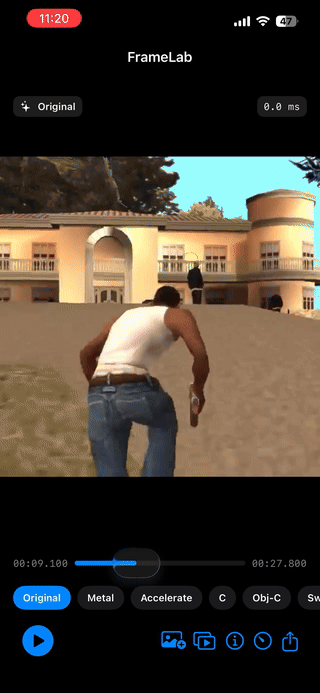
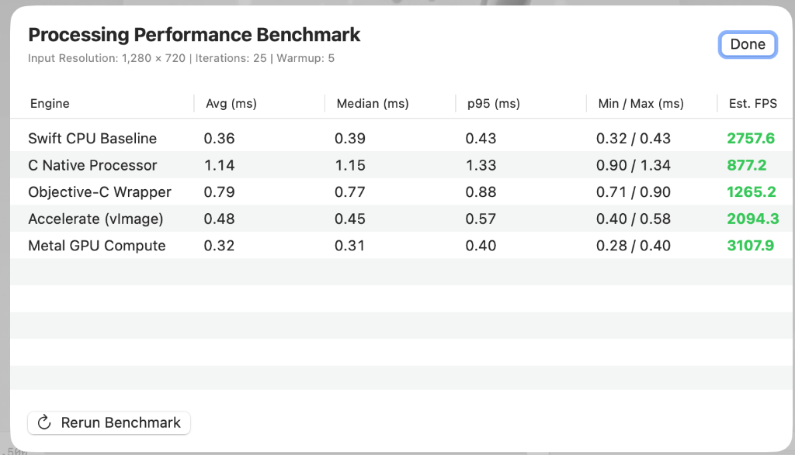

# FrameLab

<p align="left">
  <a href="https://testflight.apple.com/join/hfQEg5wB"></a>
  
  
  
</p>

FrameLab is a cross-platform macOS + iOS video engineering demonstration project built in Swift and SwiftUI.

Tagline: **Inspect. Process. Benchmark.**


---

## iOS Application Demo

Watch the uncompressed video playback, rational `CMTime` scrubbing, and live 5-engine processing switcher running natively on an iPhone:

<p align="center">
  <video src="https://raw.githubusercontent.com/alokrathaur/FrameLab/main/Docs/assets/ios_app_demo.mp4" poster="https://raw.githubusercontent.com/alokrathaur/FrameLab/main/Docs/assets/ios_app_demo_poster.png" controls="controls" width="320" style="max-width: 100%; border-radius: 16px; box-shadow: 0 4px 14px rgba(0,0,0,0.2);">
    <a href="https://raw.githubusercontent.com/alokrathaur/FrameLab/main/Docs/assets/ios_app_demo.mp4">
      
    </a>
  </video>
  <br>
  <a href="Docs/assets/ios_app_demo.mp4">▶️ <strong>Watch Full 48s HD iOS Demo Video</strong></a>
</p>

---

## Purpose

The project is intentionally small, but its architecture demonstrates Apple video-processing concepts relevant to a Mac/iOS video engineering role:

- Swift / SwiftUI
- Swift Concurrency
- GCD
- AVFoundation
- Core Media (`CMSampleBuffer`, `CMTime`)
- Core Video (`CVPixelBuffer`)
- Core Graphics
- Metal and Metal Shaders
- Accelerate / vImage
- C interoperability
- Objective-C interoperability
- Optional VideoToolbox and AudioToolbox integration
- Shared processing code across macOS and iOS

## Product Concept

Load a local video, inspect metadata, extract frames, apply a real-time grayscale filter through Metal, optionally compare Accelerate/C implementations, and preview/export a processed frame.

## Processing Performance Benchmarks

FrameLab features a built-in statistical profiler that benchmarks all 5 processing engines under identical hardware conditions:



## Target Platforms

- macOS 14+
- iOS 17+
- Xcode 16+

## Quick Start

### 1. Run the Automated Test Suite (39/39 Passing)
```bash
swift run FrameLabTests
```

### 2. Build the macOS Application
```bash
swift build --target FrameLabMac
```

### 3. Install & Test via DMG (macOS)
Double-click `FrameLab.dmg` in the repository root or mount from terminal:
```bash
open FrameLab.dmg
```

### 4. Install & Test on iPhone / iPad

#### 🚀 Option A: Official Apple TestFlight Public Beta (Recommended)

[](https://testflight.apple.com/join/hfQEg5wB)

Install FrameLab directly on your iPhone or iPad with 1 tap — no computer, no cable, and no UDID registration needed!

<p align="center">
  <a href="https://testflight.apple.com/join/hfQEg5wB">
    
  </a>
  <br>
  <a href="https://testflight.apple.com/join/hfQEg5wB">
    👉 <strong>Join Public Beta: https://testflight.apple.com/join/hfQEg5wB</strong>
  </a>
</p>

1. Open the [TestFlight Link](https://testflight.apple.com/join/hfQEg5wB) on your device or scan the QR code above with your Camera.
2. Tap **View in App Store** to get the free Apple TestFlight app if not already installed.
3. Tap **Accept** and **Install** to test FrameLab immediately.

---

#### ⚡ Option B: Sideload via IPA (Offline / Personal Apple ID)
The standalone `FrameLabIOS.ipa` package is pre-built in the repository root:
1. Connect your iPhone via USB.
2. Open [Sideloadly](https://sideloadly.io/) or [AltStore](https://altstore.io/) on your Mac/PC.
3. Drag `FrameLabIOS.ipa` into Sideloadly, enter your Apple ID, and click **Start**.

To rebuild the iOS `.ipa` package at any time from terminal:
```bash
./scripts/build_ipa.sh
```

### 4. Open in Xcode (macOS & iOS Targets)
Double-click `Package.swift` or open `FrameLab.xcworkspace` in Xcode. Select either the **FrameLabMac** or **FrameLabIOS** scheme and press **Run (Cmd+R)**.

---

## Architecture & Implementation Highlights

- **Shared Core (`FrameLabCore`):** Single cross-platform media engine shared by macOS and iOS.
- **5 Frame Processing Backends:**
  1. `MetalFrameProcessor`: Zero-copy GPU compute kernel using `CVMetalTextureCache` and `MTLComputePipelineState`.
  2. `AccelerateFrameProcessor`: Hardware vector SIMD using Apple's `vImageMatrixMultiply_ARGB8888`.
  3. `CFrameProcessor`: High-speed C routine with fixed-point integer luminance math.
  4. `ObjCFrameProcessor`: Objective-C wrapper demonstrating ARC and `NSError **` bridge.
  5. `SwiftFrameProcessor`: Baseline CPU pointer implementation.
- **Rational Canonical Time:** Internal representation uses `CMTime` rational structs to prevent floating-point drift.
- **Backpressure & Latest-Frame Dropping:** Prevents memory accumulation and UI freezes during 60/120 FPS playback.
- **Zero-Copy Memory Model:** Uses `IOSurface`-backed `CVPixelBuffer` instances to eliminate CPU ↔ GPU copies.
- **Frame Recycling:** `PixelBufferPool` wraps `CVPixelBufferPool` to achieve zero heap allocations in steady-state playback.
- **Image Export:** Uses `ImageIO` and `CGImageDestination` for high-quality PNG and JPEG frame export.
- **Built-in Benchmark:** Statistical profiler measuring Min, Max, Mean, Median (p50), 95th Percentile (p95), and FPS across all 5 engines.
- **Synthetic Test Generation:** Can generate SMPTE test bars and synthesize valid `.mp4` video files using `AVAssetWriter` on-device without network downloads.

---

## Documentation Library

- 🎓 **[Visual Learning & Architecture Guide](Docs/Learning_Video_Processing_Guide.md)** — Architectural diagrams, pipeline flowcharts, mathematical color conversion formulas, and stride/padding explanations.
- 📘 **[FrameLab Master Engineering Guide](Docs/FrameLab_Engineering_Guide.md)** — In-depth technical walkthrough, architecture analysis, definitions of all CoreMedia/CoreVideo concepts, and 15 senior interview questions & answers.
- 📑 **[Documentation Index](Docs/docs-index.md)** — Complete index of all technical and design specifications.
